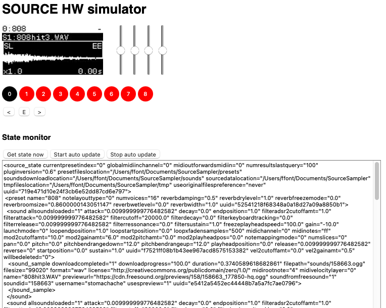

# Developers

* [Building SOURCE sampler engine](#building-source-sampler-engine)
    * [Build standalone/plugin for desktop (macOS)](#build-standaloneplugin-for-desktop-macos)
    * [Build standalone/plugin for desktop (linux)](#build-standaloneplugin-for-desktop-linux)
    * [Build plugin for Elk platform](#build-plugin-for-elk-platform)
    * [Prepare Elk development SDK](#prepare-elk-development-sdk)
    * [Prepare VST2 SDK](#prepare-vst2-sdk)
    * [Do the cross-compilation](#do-the-cross-compilation)
    * [Deploying SOURCE in the Elk board](#deploying-source-in-the-elk-board)
    * [Note about JUCE version used for SOURCE](#note-about-juce-version-used-for-source)
* [Using the BLACKBOARD simulator in development](#using-the-blackboard-simulator-in-development)
* [Architecture and *pseudo* class diagram](#architecture-and-pseudo-class-diagram)
* [Preset file strcuture](#preset-file-structure)
* [Controlling plugin from UI](#controlling-plugin-from-UI)
* [Working on the desktop plugin UI](#working-on-the-desktop-plugin-ui)
* [Adding or modifying sound parameters of the sampler engine](#adding-or-modifying-sound-parameters-of-the-sampler-engine)


## Building SOURCE sampler engine

The sampler engine of source SOURCE is implemented as a JUCE audio plug-in and can be edited and built using standard JUCE workflows. The first step is to clone this repository and init the submodules. Then, different steps apply to build SOURCE for desktop computers or for the Elk platform (see below).

```
git clone https://github.com/ffont/source.git && cd source && git submodule update --init
```

### Build standalone/plugin for desktop (macOS)

1. Clone the source code repository in your local computer

```
git clone https://github.com/ffont/source.git && cd source && git submodule update --init
```

2. Install openssl dependency (needs `brew` or something similar):

```
brew install openssl
```

3. Before compiling, note SOURCE requires a Freesound API key to connect to Freesound. You should make an account in Freesound (if you don't have one) and go to [this URL to generate an APi key](https://freesound.org/apiv2/apply). Then you should edit the file `/source/SourceSampler/Source/api_key.example.h`, add your key, and then then save and rename the file to `/source/SourceSampler/Source/api_key.h`.

4. Then you can compile SOURCE using the XCode project files in `/source/SourceSampler/Builds/MacOSX/` (see note below about compiling `BinaryBuilder` as this will be required if compiling from XCode project files). Alternatively, you can use the Python3 deploy script bundled in this repo to run the compilation step (note that you need to install dependencies for the deploy script by running `pip install -r requirements_fabfile.txt`):

```
fab compile
```

This will create *Release* versions of SOURCE (VST3, VST2, AU and Standalone) ready to work on the mac. If you need *Debug* build, you can run `fab compile-debug`.


**NOTE**: For development you might need to edit the `SourceSampler.jucer` Projucer file. To do that, you need a compatible version of Projucer installed. You can compile it (for macOS) from JUCE source files using a the deploy script running: `fab compile-projucer`. The generated executable will be in `/source/SourceSampler/3rdParty/JUCE/extras/Projucer/Builds/MacOSX/build/Release/Projucer.app`.

**NOTE 2**: SOURCE is configured to build a VST2 version of the plugin (together with VST3, AudioUnit and StandAlone). VST2 is currently only needed for the Elk build as there still seem to be some issues with JUCE6 + VST3 in linux. However, VST is not really needed for the macOS compilation. If you don't have the VST2 SDK available, just open `SourceSampler.jucer` (you'll need to compile Projucer first as described in the previous step) and untick `VST Legacy` option.

**NOTE 3**: macOS build targets include a *pre-build shell script* phase which generates the `BinaryData.h/.cpp` files needed for the plugin to show the UI. These files are generated with the `BinaryBuilder` util provided in the JUCE codebase. `BinaryBuilder` is compiled as part of the build process so you should encounter no issues with that.


### Build standalone/plugin for desktop (linux)


1. Clone the source code repository in your local computer

```
git clone https://github.com/ffont/source.git && cd source && git submodule update --init
```

2. Install system dependencies:

```
sudo apt update
sudo apt install libasound2-dev libjack-jackd2-dev \
    libcurl4-openssl-dev libssl-dev \
    libfreetype6-dev \
    libx11-dev libxcomposite-dev libxcursor-dev libxcursor-dev libxext-dev libxinerama-dev libxrandr-dev libxrender-dev \
    libwebkit2gtk-4.0-dev \
    libglu1-mesa-dev mesa-common-dev
sudo apt-get install xvfb
```

3. Before compiling, note SOURCE requires a Freesound API key to connect to Freesound. You should make an account in Freesound (if you don't have one) and go to [this URL to generate an APi key](https://freesound.org/apiv2/apply). Then you should edit the file `/source/SourceSampler/Source/api_key.example.h`, add your key, and then then save and rename the file to `/source/SourceSampler/Source/api_key.h`.

4. Use the Python3 deploy script bundled in this repo to run the compilation step (note that you need to install dependencies for the deploy script by running `pip install -r requirements_fabfile.txt`):

```
fab compile
```

This will create *Release* versions of SOURCE (VST3, VST2, and Standalone) ready to work on linux. If you need *Debug* build, you can run `fab compile-debug`.


**NOTE**: For development you might need to edit the `SourceSampler.jucer` Projucer file. To do that, you need a compatible version of Projucer installed. You can compile it (for macOS) from JUCE source files using a the deploy script running: `fab compile-projucer`. The generated executable will be in `/source/SourceSampler/3rdParty/JUCE/extras/Projucer/Builds/LinuxMakefile/build/Projucer.app`.

**NOTE 2**: SOURCE is configured to build a VST2 version of the plugin (together with VST3, AudioUnit and StandAlone). VST2 is currently only needed for the Elk build as there still seem to be some issues with JUCE6 + VST3 in linux. However, VST is not really needed for the macOS compilation. If you don't have the VST2 SDK available, just open `SourceSampler.jucer` (you'll need to compile Projucer first as described in the previous step) and untick `VST Legacy` option.

**NOTE 3**: a JUCE utility tool is needed to generate the `BinaryData.h/.cpp` files needed for the plugin to show the UI. These files are generated with the `BinaryBuilder` util provided in the JUCE codebase. `BinaryBuilder` is compiled as part of the build script so you should encounter no issues with that.


### Build plugin for Elk platform

To build SOURCE for Elk Audio OS you need to cross-compile it from your development computer. To do that, I use a Docker-based solution on macOS. The instructions here are therefore for cross-compiling from macOS and using Docker. For cross-compilation from Linux it should be simpler and you should refer to the Elk docs. The python deploy script bundled in this repository will automate most of the steps for compiling SOURCE for the Elk platform. To run that script you'll need to install the required Python3 dependencies by running `pip install -r requirements_fabfile.txt`. The sections below guide you through the process of preparing your dev environment for compiling SOURCE for the Elk platform and show how to do th actual compilation.


#### Prepare Elk development SDK

The first thing to do is to prepare the Elk development SDK Docker image following the [instrucitons here](https://github.com/elk-audio/elkpi-sdk/blob/master/running_docker_container_on_macos.md). You need to run steps 1 to 3, no need to run the toolchain when everything installed.


#### Prepare VST2 SDK

Even though JUCE 6 has support for VST3 plugins in Linux, I've had some issues with VST3 versions of plugins in Linux and therefore SOURCE is still being built as VST2. This means that you need the VST2 SDK installed in your computer to compile SOURCE. Make sure that the `PATH_TO_VST2_SDK` variable in `fabfile.py` points to a valid distribution of the VST2 SDK. This will be mounted in the Docker container that does the cross-compilation. Of course you also need to get the VST2 SDK files from somewhere.

#### Do the cross-compilation

With all this in place, you should be able to cross-compile SOURCE for Elk in a very similar way as you would do it for the desktop version, using the deploy script:

```
fab compile-elk
```

(if you need a *Debug* build, you can use `fab compile-elk-debug`)

This will take a while, specially the first time it runs. When it finishes, it should have generated a `SourceSampler.so` file in `source/Builds/ElkAudioOS/build/` which is the VST2 plugin that you can run in the Elk platform. It also generates a VST3 in `source/Builds/ElkAudioOS/build/SourceSampler.vst3` which should also compatible with the Elk platform but there still seem to be issues with the VST3 version so it is not really used.

**NOTE**: The build script for the cross compilation includes a step which generates the `BinaryData.h/.cpp` files needed for the plugin to include up-to-date resources (mainly `index.html`). This is run in the host machine and not in the Docker container. For this step to succeed, you need to compile the  `BinaryBuilder` util provided by JUCE. You can compile that by running `fab compile-binary-builder-macos`.


#### Deploying SOURCE in the Elk board

Once the plugin is compiled for the Elk architecture, you can install it in the Elk board by following the steps for [Running SOURCE in the Elk hardware stack](#running-source-in-the-elk-hardware-stack).


### Note about JUCE version used for SOURCE

The current version of SOURCE uses JUCE 6 which has native support for VST3 plugins in Linux and for headless plugins. Therefore, unlike previous version of SOURCE, we don't need any patched version of JUCE and we can simply use the official release :) However, there still seem to be problems with VST3 and Linux related with timers, so we use VST2 builds.

 
## Using the BLACKBOARD simulator in development

In order to facilitate development of the *hardware* version of SOURCE when the Elk tech stack is not available, the *glue app* implemented in Python3 can also be run from your local computer and includes a web simulator of the BLACKBOARD hardware that can be used as user interface. The glue app will communicate with the plugin, which must be running also in your local computer as a standalone app and must have been compiled in Debug mode, and you can point your browser at `http://localhost:8123/simulator` to see the BLACKBOARD simulator that looks like this:

<p align="center">

</p>

These are the steps to get the simulator up and running:

1. Compile the desktop version of the plugin in Debug mode and run it as a Standalone app (or as a plugin inside a DAW)
2. Install python dependencies for the glue app, and run the glue app

```
cd elk_platform/ui_app
pip install -r requirements.txt
pyhon main
```
3. Point your browser to `http://localhost:8123/simulator` and use the buttons on screen to interact with the plugin as if interactions came from the hardware BLACKBOARD.


## Architecture and *pseudo* class diagram

TODO


## Preset file strcuture

TODO


## Controlling plugin from UI

TODO


## Working on the desktop plugin UI

The desktop version of the plugin has its own UI which is implemented using HTML/Javascript and is loaded in the plugin using JUCE's *WebBrowserComponent*. Here is the code for the desktop plugin UI https://github.com/ffont/source/blob/master/SourceSampler/Resources/ui_plugin_ws.html. The plugin embeds a WebSockets server to implement bi-directional communication with the plugin HTML/Javascript UI. The plugin also embeds an HTML server which is used for serving sound files to the UI so that waveforms can bw shown.

The `ui_plugin_ws.html` file conataining the desktop UI is embedded in the plugin binary at compile time, therefore if changed need to be done to the UI the whole plugin needs to be re-comiled for these changes to take effect in the plugin (or standalone app). However, if while the plugin is running (in Debug mode), the `ui_plugin_ws.html` is opened with a standard web browser, then the interface is rendered in the browser and it can also connect to the running plugin instance. Now, the borwser console can be used to instpect the state of the UI, and the HTML file can be edited with your editor of choice and the browser page reloaded in the browser for any changes to take effect (without the need of recompiling the whole plugin). This tick is very conveinent when working on the UI :)

Also note that this desktop UI can also be used when the plugin is running in the Elk board by simply configuring the WebSockets host and port to that of the plugin instance running in the Elk board.

**WARNING**: when working on Linux and using Chrome browser to open the UI, we've observed issues if re-starting the plugin while UI is still loaded in Chrome.


## Adding or modifying sound parameters of the sampler engine

The SOURCE sampler engine has a many editable sound parameters including things like *start position*, *end position*, *pitch*, *filter cutoff*, etc. Because there are many of these parameters and there is a lot of "repeated" code for setting up the parameters and doing some stuff witht them, this repository includes a python script that auto-generates most of the code needed for deadling with such parameters (for implementing getters, setters, etc). The script can be found here https://github.com/ffont/source/blob/master/SourceSampler/generate_code.py and has no special python dependencies.

To edit existing sound parameters or add/remove new ones, you can do that by editing the [data_for_code_gen.csv](https://github.com/ffont/source/blob/master/SourceSampler/data_for_code_gen.csv) CSV file (in which you have information about the parameter names, min/max/default values and other potentialy relevant things), and then run:

```
cd SourceSampler
python geneate_code.py -i
```

After that the parameters will be available in your `SourceSound` objects, and will also be automatically added to the desktop UI of the plugin.