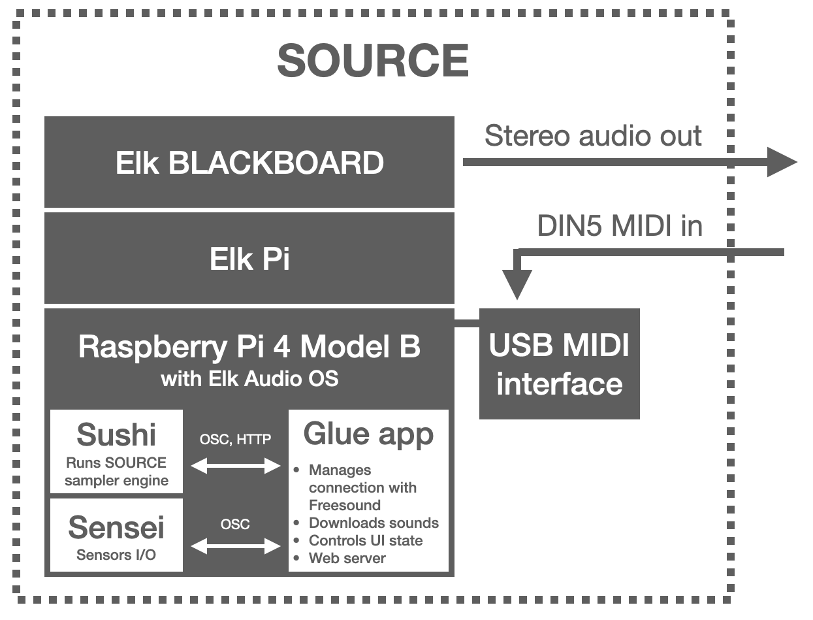

<p align="center">

</p>


# About

SOURCE is an open-source music sampler powered by [Freesound](https://freesound.org)'s collection of 500k Creative Commons sounds contributed by a community of thousands of people around the world. SOURCE is a sampler that *does not sample*. Instead, it provides different ways to load sounds from Freesound and instantly generate new sound palettes to enrich your creative process and bring in an endless SOURCE of inspiration.

SOURCE is designed to run as a stand-alone device on a hardware solution based on a [Raspberry Pi 4](https://www.raspberrypi.org/products/raspberry-pi-4-model-b/), the [Elk Pi](https://elk.audio/extended-dev-kit) hat for the Raspberry Pi (which provides low-latency multi-channel audio I/O), and the [Elk BLACKBOARD](https://elk.audio/blackboard) controller board (which provides the user interface elements including buttons, faders, a display, and the audio I/O connectors). However, the core of SOURCE is implemented as a standard audio plugin using [JUCE](https://juce.com). That allows SOURCE to also be loaded in DAWs that support VST/AU plugins, or even run as a stand-alone and cross-platform application in desktop computers (eventhough with somewhat limited functionality). The picture below shows the looks of SOURCE as deployed with the Elk hardware stack:

<p align="center">

</p>


The following video demonstrates some of the functionalities of SOURCE in action: *link comming soon*.


Why making SOURCE? As a researcher at the [Music Technology Group](https://www.upf.edu/web/mtg/) of [Universitat Pompeu Fabra](https://www.upf.edu), I have been leading the development of the Freesound website and coordinating research projects around it for a number of years. I've been always interested in how to take advantage of the creative potential of Freesound's huge sound collection, and in ways to better integrate Freesound in the creative process. Even though 
SOURCE started as a personal side project (that's why the [Rita & Aurora](https://ritaandaurora.github.io) logo is shown below, a fancy name I sometimes use for audio dev side-projects), I soon realized about the potential of the prototype and saw that SOURCE can bring together many of the research ideas that we have been experimenting with at the MTG in the last years. I believe that SOURCE can be a great music-making tool for creators, but I also think it can be a great playground for experimentation and research about the interaction between hardware devices and huge sound collections like Freesound.


## How it works

SOURCE is composed of a number of software processes that run on a hardware solution based on a [Raspberry Pi 4](https://www.raspberrypi.org/products/raspberry-pi-4-model-b/), the [Elk Pi](https://elk.audio/extended-dev-kit) hat for the Raspberry Pi (which provides low-latency multi-channel audio I/O), and the [Elk BLACKBOARD](https://elk.audio/blackboard) controller board (which provides the user interface elements including buttons, faders, a display, and the audio I/O connectors).
All software processes run under [Elk Audio OS](https://elk.audio/audio-os), an operative system optimized for low-latency and real-time audio systems. The core of SOURCE is the *sampler engine* which is implemented as a VST plugin and is run by the *sushi* process (a plugin host bundled with Elk Audio OS). The communication with the sensors of the controller board is carried out by the *sensei* process, which is also part of the Elk Audio OS distribution. Finally, a *glue app* is responsible for connecting all the sub-systems together (mostly via Open Sound Control), controlling the state of the user interface, exposing an HTTP endopoint that offers a complementary user interface, and, most importantly, communicating with Freesound to search and download sounds. Below there is a block diagram including all the aforementioned software processes and hardware elements. 

<p align="center">

</p>


## How can I run SOURCE


TODO...


# Instructions for developers


## Building SOURCE sampler engine

The sampler engine of source SOURCE is implemented as a JUCE audio plug-in and can be edited and built using standard JUCE workflows. The first step is to clone this repository and init the submodules. Then, different steps apply to build SOURCE for desktop computers or for the ELK platform (see below).

```
git clone https://github.com/ffont/source.git && cd source && git submodule update --init
```


### Build standalone/plugin for desktop (macOS)

For development purposes (or to run SOURCE in a desktop computer insead of the ELK platform), you can use the XCode project files generated by Projucer. You can also generate exporters for other platforms using Projucer, but I only tested macOS.

Alternatively, you can also use the Python *Fabric 2* script (see below) provided im the `scripts` folder. Do it like that:

```
fab compile-macos
```

This will create *Release* versions of SOURCE (VST3, VST2, AU and Standalone) ready to work on the mac. If you need *Debug* build, you can run `fab compile-macos-debug`.

**NOTE**: macOS build targets include a *pre-build shell script* phase which generates the `BinaryData.h/.cpp` files needed for the plugin to include up-to-date resources (mainly `index.html`). These files are generated with the `BinaryBuilder` util provided in the JUCE codebase. `BinaryBuilder` is compiled as part of the build process so you should encounter no issues with that.

**NOTE 2**: macOS build targets require `openssl` to implement the HTTPS sevrer that hosts the plugin UI. Install by using `brew install openssl`.

**NOTE 3**: SOURCE requires a Freesound API key to connect to Freesound. You should make an account in Freesound (if you don't have one) and go to [this URL to generate an APi key](https://freesound.org/apiv2/apply). Then you should edit the file `/source/SourceSampler/Source/api_key.example.h`, add your key, and then then save and rename the file to `/source/SourceSampler/Source/api_key.h`.

**NOTE 4**: For development you might need to edit the `SourceSampler.jucer` Projucer file. To do that, you need a compatible version of Projucer installed. You can compile it (for macOS) from JUCE source files using a the *Fabric 2* Python script running: `fab compile-projucer-macos`. The generated executable will be in `/source/SourceSampler/3rdParty/JUCE/extras/Projucer/Builds/MacOSX/build/Release/Projucer.app`.

**NOTE 5**: It should be very easy to adapt these instructions for Windows or Linux. You'll basically need to create an exporter for these other platforms an make small changes to compile `BinaryBuilder`, `Projucer` and install/link the dependencies.

**NOTE 6**: SOURCE is configured to build a VST2 version of the plugin (together with VST3, AudioUnit and StandAlone). VST2 is currently only needed for the ELK build as there still seem to be some issues with JUCE6 + VST3 in linux. However, VST is not really needed for the macOS compilation. If you don't have the VST2 SDK, just open `SourceSampler.jucer` and untick `VST Legacy` option.


### Build plugin for ELK platform

To build SOURCE for ELK Audio OS you need to cross-compile it from your development computer. To do that, I use a Docker-based solution on macOS. The instructions here are therefore for cross-compiling from macOS and using Docker. For cross-compilation from Linux it should be simpler and you should refer to the ELK docs.

To do the cross compilation (and also deployment to the board) I prepared a Python script using [Fabric 2](http://www.fabfile.org) so I assume you have a Python 3 interpreter installed in your system with the Fabric 2 package installed (`pip install fabric` should do it).


#### Prepare ELK development SDK

The first thing to do is to prepare the ELK development SDK Docker image following the [instrucitons here](https://github.com/elk-audio/elkpi-sdk/blob/master/running_docker_container_on_macos.md). You need to run steps 1 to 3, no need to run the toolchain when everything installed.

#### Prepare VST2 SDK

Even though JUCE 6 has support for VST3 plugins in Linux, I've had some issues with VST3 versions of plugins in Linux and therefore SOURCE is still being built as VST2. This means that you need the VST2 SDK installed in your computer to compile SOURCE. Make sure that the `PATH_TO_VST2_SDK` variable in `fabfile.py` points to a valid distribution of the VST2 SDK. This will be mounted in the Docker container that does the cross-compilation.

#### Do the cross-compilation

With all this in place, you should be able to cross-compile SOURCE for ELK in a very similar way as you would do it for the desktop, using the Fabric script:

```
fab compile-elk
```

(if you need a *Debug* build, you can use `fab compile-elk-debug`)

This will take a while, specially the first time it runs. When it finishes, it should have generated a `SourceSampler.so` file in `source/Builds/ELKAudioOS/build/` which is the VST2 plugin that you can run in the ELK platform. It also generates a VST3 in `source/Builds/ELKAudioOS/build/SourceSampler.vst3` which should also compatible with the ELK platform but as I mentioend before it does not seem to work properly.

**NOTE**: The build script for the cross compilation includes a step which generates the `BinaryData.h/.cpp` files needed for the plugin to include up-to-date resources (mainly `index.html`). This is run in the host machine and not in the Docker container. For this step to succeed, you need to compile the  `BinaryBuilder` util provided by JUCE. You can compile that using the project files you'll find in `/source/SourceSampler/3rdParty/JUCE/extras/BinaryBuilder/Builds/` or by running `fab compile-binary-builder-macos`.


#### Loading the built plugin in the ELK board

You can send the plugin to the board using the command:

```
fab send-elk
```

This will send both the generated plugin files and other SOURCE configuration files.


### Note about JUCE version used for SOURCE

The current version of SOURCE uses JUCE 6 which has native support for VST3 plugins in Linux and for headless plugins. Therefore, unlike previous version of SOURCE, we don't need any patched version of JUCE and we can simply use the official release :) However, there still seem to be problems with VST3 and Linux, so we use VST2 
builds.

## Running SOURCE in the ELK platform (with BLACKBOARD hat)

The run SOURCE in the ELK platform you'll need to configure services to run the `sushi` process with the built sampler engine, the `sensei` process with the BLACKBOARD sensors configuration settings, and finally the `source` process which runs the glue app which connects all systems together, manages the user interface and connects to Freesound (indluding downloading sounds).


### Configure systemd services

These instructions are based on the official ELK instructions for automatic startup of services: https://elk-audio.github.io/elk-docs/html/documents/working_with_elk_board.html#configuring-automatic-startup

1) Modify `sushi` service (`/lib/systemd/system/sushi.service`) to point to `/udata/source/app/source_sushi_config.json` and add restart policy. Change lines:

```
[Service]
Type=simple
RemainAfterExit=no
WorkingDirectory=/udata/
Environment=LD_LIBRARY_PATH=/usr/xenomai/lib
ExecStart=/usr/bin/sushi -r --multicore-processing=3 -c /udata/source/app/source_sushi_config.json
User=mind
Restart=always
RestartSec=3
```

2) Modify `sensei` service (`/lib/systemd/system/sensei.service`) to point to `/udata/source/app/source_sensei_config.json`. Change line:

```
Environment=LD_LIBRARY_PATH=/usr/xenomai/lib
ExecStart=/usr/bin/sensei -f /udata/source/app/source_sensei_config.json
```

3) Create new service for the Python glue app at `/lib/systemd/system/source.service` (use `sudo`). 

```
[Unit]
Description=source glue app
After=sensei.service

[Service]
Type=simple
RemainAfterExit=no
WorkingDirectory=/udata/source/app/
ExecStart=python3 main
User=mind
Restart=always
RestartSec=3

[Install]
WantedBy=multi-user.target
```

4) Enable `sushi`, `sensei`, and `source` services

```
sudo systemctl enable sushi
sudo systemctl enable sensei
sudo systemctl enable source
```

Now all these services will start automatically on start up. The `send-elk` command of the `fabfile.py` triggers service restarts after deploying new versions of the files. However, you can manually restart the services using `sudo systemctl enable xxx`.

You can check stdout logs for the services with:

```
sudo journalctl -fu sushi
sudo journalctl -fu sensei
sudo journalctl -fu source
```

### Give more sudo permissions to "mind" user

To run SOURCE, user `mind` needs to have `sudo` control without entering password. This is mainly because of the `collect_system_stats` routine called in the `main` glue app. However, it looks like wihtout having sudo capabilities,
running `sensei` might also fail. To add sudo capabilities:

 * switch to user `root` (`sudo su`)
 * edit `/etc/sudoers` to add the line `mind ALL=(ALL) NOPASSWD: ALL` in the *User privilege specification* AND comment the line `# %sudo ALL=(ALL) ALL`. **NOTE**: this gives too many permissions to `mind` user and should be fixed to give only what is needed.
    
    
# License

SOURCE is released under the **GPLv3** open source software license (see [LICENSE](https://github.com/ffont/source/blob/master/LICENSE) file) with the code being available at  [https://github.com/ffont/source](https://github.com/ffont/source). Source uses the following open source software libraries: 

* [juce](https://juce.com), available under GPLv3 license ([@7c797c8](https://github.com/juce-framework/JUCE/tree/7c797c8105c2d41872e6e8d08972624f0afd335d), v6.0.5)
* [cpp-httplib](https://github.com/yhirose/cpp-httplib), available under MIT license ([@3da4a0a](https://github.com/yhirose/cpp-httplib/tree/3da4a0a))
* [ff_meters](https://github.com/ffAudio/ff_meters), available under BSD 3 clause license ([@711ee87](https://github.com/ffont/ff_meters/tree/711ee87862e1c2485536e977ab57b1f78b84667f), I use a fork I made with a small patch for compatibility with ELK)
* [twine](https://github.com/elk-audio/twine), vailable under GPLv3 license ([@1257d93](https://github.com/elk-audio/twine/tree/1257d93882cf9fd120539a2ce5497fcbef22af82))

<br><br>
<p align="center">

&nbsp;&nbsp;&nbsp;&nbsp;&nbsp;&nbsp;&nbsp;&nbsp;&nbsp;

</p>
