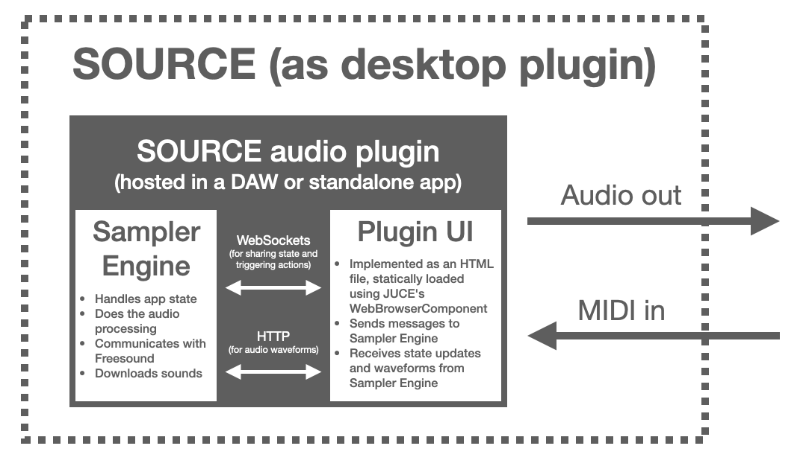

<p align="center">

</p>


Table of Contents
=================

   * [Table of Contents](#table-of-contents)
   * [About](#about)
      * [Why making SOURCE?](#why-making-source)
      * [Features](#features)
      * [How it works](#how-it-works)
      * [How can I run SOURCE](#how-can-i-run-source)
         * [Running SOURCE in the Elk hardware stack](#running-source-in-the-elk-hardware-stack)
         * [Running SOURCE as an audio plugin or standalone app in desktop/laptop computers](#running-source-as-an-audio-plugin-or-standalone-app-in-desktoplaptop-computers)
   * [Instructions for developers](#instructions-for-developers)
   * [SOURCE + Shepherd](#source-+-shepherd)
   * [License](#license)


# About

SOURCE is an open-source music sampler powered by [Freesound](https://freesound.org)'s collection of 500k Creative Commons sounds contributed by a community of thousands of people around the world. SOURCE is a sampler that *does not sample*. Instead, it provides different ways to load sounds from Freesound and instantly generate new sound palettes to enrich the creative process and bring an endless SOURCE of inspiration.

SOURCE is designed to run as a stand-alone device on a **hardware solution** based on a [Raspberry Pi 4](https://www.raspberrypi.org/products/raspberry-pi-4-model-b/), the [Elk Pi](https://elk.audio/extended-dev-kit) hat for the Raspberry Pi (which provides low-latency multi-channel audio I/O), and the [Elk BLACKBOARD](https://elk.audio/blackboard) controller board (which provides the user interface elements including buttons, faders, a display, and the audio I/O connectors). However, the core of SOURCE is implemented as a standard audio plugin using [JUCE](https://juce.com). That allows SOURCE to **also be loaded in DAWs that support VST/AU plugins, or even run as a stand-alone** application in desktop computers (eventhough with somewhat limited functionality). The picture below shows the looks of SOURCE as deployed with the Elk hardware stack:

<p align="center">

</p>

To see SOURCE in action you can check out this **demo video**: https://youtu.be/7EXMY0AvBxo
Also, I published a paper about source in the **2nd International Workshop on the Internet of Sounds**, part of the **Audio Mostly 2021** conference. I'm happy to say that SOURCE got the the **Best Demo Award** and the **Industry Award** (awared by Elk) in Audio Mostly 2021. Here is the citation information for the paper (and the [PDF](https://repositori.upf.edu/bitstream/handle/10230/48719/font_am21_source.pdf?sequence=1&isAllowed=y)):

```
Font F. "SOURCE: a Freesound community music sampler." In: Audio mostly, A conference on interaction with sound. Proceedings of the 16th International Audio Mostly Conference AM’ 21; 2021 Sep 1-3; Trento, Italy. New York: Association for Computing Machinery; 2021. p. 182-7. DOI: 10.1145/3478384.3478388 
```


## Why making SOURCE? 

As a researcher at the [Music Technology Group](https://www.upf.edu/web/mtg/) of [Universitat Pompeu Fabra](https://www.upf.edu), I have been leading the development of the Freesound website and coordinating research projects around it for a number of years. I've been always interested in how to take advantage of the creative potential of Freesound's huge sound collection, and in ways to better integrate Freesound in the creative process. Even though 
SOURCE started as a personal side project (that's why the [Rita & Aurora](https://ritaandaurora.github.io) logo is shown below, a fancy name I sometimes use for audio dev side-projects), I soon realized about the potential of the prototype and saw that SOURCE can bring together many of the research ideas that we have been experimenting with at the MTG in the last years. I believe that SOURCE can be a great music-making tool for creators, but I also think it can be a great playground for experimentation and research about the interaction between hardware devices and huge sound collections like Freesound.


## Features

SOURCE implements audio playback functionality which is common in many existing music samplers. Perhaps more interesting and unique are the capabilities of SOURCE for interacting with Freesound, searching and retrieving sounds. The SOURCE demonstration video linked above showcases some of these possibilities. Here is a (potentially incomplete) list of features:

* Search sounds in Freesound in real-time and download them to the sampler
* Filter sounds by:
 * Textual query terms
 * Duration
 * Creative Commons license
 * Perceptual qualities like: *brightness*, *hardness* and *depth*
* Replace loaded sounds by other sounds that are acoustically similar (using Freesound's similarity search feature)
* Random search mode that will retrieve unexpected sounds from Freesound
* Load any number of sounds (only limited by RAM memory)
* Map loaded sounds to MIDI notes automatically using *contiguous* or *interleaved* modes, or map them arbitrarily using a mapping editor
* For each sound loaded, configure sound paramters such as:
 * Start and end position
 * Play modes including looping and slicing
 * Loop start and end positions
 * ADSR amplitude envelope
 * Low-pass filter with ADSR envelope
 * MIDI root note and global pitch shift (based on playback speed)
 * Freeze mode in which the playhead position can be controlled as a sound parameter
 * Modulation of some of the above parameters with velocity and aftertouch (including support for polyhonic aftertouch)
 * Control some of the above parameters with MIDI Control Change
* Support for velocity layers and multi-sampled instruments
* Get a *sound usage log* which lists the historic of sounds that have been used and can help in the Creative Commons attribution process

Note that the most interesting bit of SOURCE is it's methods for interacting with Freesound. The audio engine itself is rather basic and, well, those experience music sampler developers might find it naive. I'm open to contributions if anyone with more experience implementing music samplers wants to help :)

## How it works

SOURCE is composed of a number of software processes that run on a hardware solution based on a [Raspberry Pi 4](https://www.raspberrypi.org/products/raspberry-pi-4-model-b/), the [Elk Pi](https://elk.audio/extended-dev-kit) hat for the Raspberry Pi (which provides low-latency multi-channel audio I/O), and the [Elk BLACKBOARD](https://elk.audio/blackboard) controller board (which provides the user interface elements including buttons, faders, a display, and the audio I/O connectors). All software processes run under [Elk Audio OS](https://elk.audio/audio-os), an operative system optimized for low-latency and real-time audio systems. The core of SOURCE is the *sampler engine* which is implemented as a VST plugin and is run by the *sushi* process (a plugin host bundled with Elk Audio OS). The communication with the sensors of the controller board is carried out by the *sensei* process, which is also part of the Elk Audio OS distribution. Finally, a *glue app* is responsible for connecting all the sub-systems together (mostly via Open Sound Control/WebSockets), controlling the state of the user interface, exposing an HTTP endopoint that offers a complementary user interface, and, most importantly, communicating with Freesound to search and download sounds. Below there is a block diagram including all the aforementioned software processes and hardware elements. 

<p align="center">

</p>

When running as an audio plugin or stand-alone app in a Desktop computer, SOURCE bundles an HTML-based user interface which is loaded in the plugin itself. Below is a block diagram of SOURCE when running as a plugin or stand-alone app in a desktop computer. 

<p align="center">

</p>

More information about SOURCE architecture and internal details is documented in the [DEVELOPERS][DEVELOPERS.md] section.


## How can I run SOURCE

### Running SOURCE in the Elk hardware stack

This repository includes a deploy script written in Python3 (using the [`fabric`](http://www.fabfile.org) package) which will carry out most of the necessary deployment steps for running SOURCE in the Elk hardware stack. However, a number of things need to be done before running the deploy script. The steps below assume that you have a Rasoberry Pi with an Elk Pi hat and the Elk BLACKBOARD with Elk Audio OS (>=0.7.2) up and running and that you can access it through `ssh` using the default user `mind` created by the Elk Auiod OS installation. If you're looking at running SOURCE as an audio plugin in a desktop computer, see the [instructions below](#running-source-as-an-audio-plugin-or-standalone-app-in-desktoplaptop-computers).


1. Clone the source code repository in your local computer

```
git clone https://github.com/ffont/source.git && cd source && git submodule update --init
```

2. Get a Freesound API key from https://freesound.org/apiv2/apply, and create a file named `freesound_api_key.py` inside the `elk_platform/ui_app` folder of the cloned repository with the contents:

```
FREESOUND_API_KEY = "YOUR FREESOUND API KEY"
FREESOUND_CLIENT_ID = "YOUR FREESOUND CLIENT ID"
```

3. Install Python3 depencies of the deploy script in your local computer

```
pip install -r requirements_fabfile.txt
```

4. Download the *pre-compiled binaries* of the latest release of SOURCE sampler engine for the Elk platform (or [build them locally following the instructions](DEVELOPERS.md#build-plugin-for-elk-platform) from the DEVELOPERS file). Copy `SourceSampler.so` to `SourceSampler/Builds/ElkAudioOS/build/SourceSampler.so` (you might need to create intermediate folders). Note that this path is relative to the root of the cloned repository. 

5. Configure key-based ssh access to the Elk board form the local machine. If you already have ssh keys created in your local computer, you can install them in the Elk board running something like `ssh-copy-id - i ~/.ssh/id_rsa.pub mind@your-elk-board-hostname`.

6. Give extra sudo permissions to `mind` user in the Elk board. Follow these steps:

   * ssh into the Elk board and run `sudo su` to switch to `root` user 
   * rdit `/etc/sudoers` to add the line `mind ALL=(ALL) NOPASSWD: ALL` in the *User privilege specification* AND comment the line `# %sudo ALL=(ALL) ALL`.

7. Edit the file named `fabfile.py` and set the `host` varialbe in line 7 to match the host of your Elk board.

After the above steps, you can run the SOURCE deploy script using the command below. This will copy all the necessary app files to the board, configure the `systemd` services `sushi` (the audio plugin), `source` (the glue app/UI app) and `sensei` (the inerface with physical sensors), and start them. This will also configure the services to auto start on boot.

8. Run `fab deploy-elk`

And that's it! While the above mentioned services are running in the Elk board, you can use these utility commands bundled in the deploy script to see their logs:

```
fab logs-sushi
fab logs-source
fab logs-sensi
```

Note that to get **MIDI input** working you'll need to use a USB MIDI controller or interface, and might need to [edit this line of code](https://github.com/ffont/source/blob/b0b82a9712341e3280e45053239df48b8dbe8a5f/elk_platform/ui_app/main#L285) and set the id of the USB MIDI controller/interface (you can get a list of MIDI devices ids in the Elk board running `aconnect -l`).


### Running SOURCE as an audio plugin or standalone app in desktop/laptop computers

SOURCE can also be run as a desktop audio plugin. This version of SOURCE lacks some functionality with respect to the hardware version, but it is perfectly usable and has its own graphical UI.

<p align="center">

</p>

**macOS**

To use SOURCE as an audio plugin in macOS you can simply download the pre-compiled binary files from the [releases](https://github.com/ffont/source/releases) section and copy them to the appropriate audio plugin system locations (that is to download the latest release fiels and copy `SourceSampler.component` to `/Library/Audio/Plug-Ins/Components` and/or copy `SourceSampler.vst3` to /`Library/Audio/Plug-Ins/VST3`).

On macOS, SOURCE can also be run as a standalone application by opening the `SourceSampler.app` bundle included in the release files.

**linux**

We don't include pre-compiled binaries for linux as part of the releases, so SOURCE must be compiled from source in order to run on linux. Follow the instructions for [compiling SOURCE for linux platform](DEVELOPERS.md#build-standaloneplugin-for-desktop-linux) from the DEVELOPERS file, it is rather easy :)

**windows**

We don't include pre-compiled binaries for windows as part of the releases, so SOURCE must be compiled from source in order to run on windows. However, because the engine of SOURCE is implemented as a JUCE audio plug-in, it should not be complicated to add exporters for windows to the Projucer file and compile. In the future I might consider including pre-built binaries windows as well.


# Instructions for developers

For particular compilation instructions and notes for development, please see the [DEVELOPERS](DEVELOPERS.md) file.


# SOURCE + Shepherd

There is an experimental *version* of SOURCE which incorporate an open source MIDI sequencer in which I've also been working named [Shepherd](http://github.com/ffont/shepherd). This integrates with SOURCE to provide sequencing capabilities using a grid of MIDI clips *a la* Ableton Live. The functionalities of the sequencer are rather basic, but when used in combination with SOURCE can work a stand-alone music making machine. As a user interface, the combination of SOURCE + Shepherd uses Ableton's Push2. More information about this combination and how to make it work can be provided upon request.


# License

SOURCE is released under the **GPLv3** open source software license (see [LICENSE](https://github.com/ffont/source/blob/master/LICENSE) file) with the code being available at  [https://github.com/ffont/source](https://github.com/ffont/source). Source uses the following open source software libraries: 

* [juce](https://juce.com), available under GPLv3 license ([@2f98020](https://github.com/juce-framework/JUCE/commit/2f980209cc4091a4490bb1bafc5d530f16834e58), v6.1.6)
* [ff_meters](https://github.com/ffAudio/ff_meters), available under BSD 3 clause license ([@711ee87](https://github.com/ffont/ff_meters/tree/711ee87862e1c2485536e977ab57b1f78b84667f), I use a fork I made with a small patch for compatibility with Elk)
* [twine](https://github.com/elk-audio/twine), available under GPLv3 license ([@1257d93](https://github.com/elk-audio/twine/tree/1257d93882cf9fd120539a2ce5497fcbef22af82))
* [asio](https://github.com/chriskohlhoff/asio), available under Boost Sofrware License] ([@f0a1e1c](https://github.com/chriskohlhoff/asio/tree/f0a1e1c7c0387ad16358c81eb52528f190df625c))
* [Simple-WebSocket-Server](https://gitlab.com/eidheim/Simple-WebSocket-Server), available under MIT license ([@a091e7c](https://gitlab.com/eidheim/Simple-WebSocket-Server/-/tree/a091e7cfb1587e3c0340bc7d2d850a4e44c03e11))
* [Simple-Web-Server](https://gitlab.com/eidheim/Simple-Web-Server), available under MIT license ([@bdb1057](https://gitlab.com/eidheim/Simple-Web-Server/-/tree/bdb105712bc4cebc993de89b62e382b92102b347))
* [shepherd](https://github.com/ffont/shepherd), available under GPLv3 license ([@9adc415](https://github.com/ffont/shepherd/commit/9adc4151105d3ecaaca2c3478fdb120484558e25))
* [signalsmith-stretch](https://github.com/Signalsmith-Audio/signalsmith-stretch), available under MIT license ([@37db3a7](https://github.com/Signalsmith-Audio/signalsmith-stretch/commit/37db3a75a40ce1f8b596302a8277d7b41eeb1f5b))

<br><br>
<p align="center">

&nbsp;&nbsp;&nbsp;&nbsp;&nbsp;&nbsp;&nbsp;&nbsp;&nbsp;

</p>
