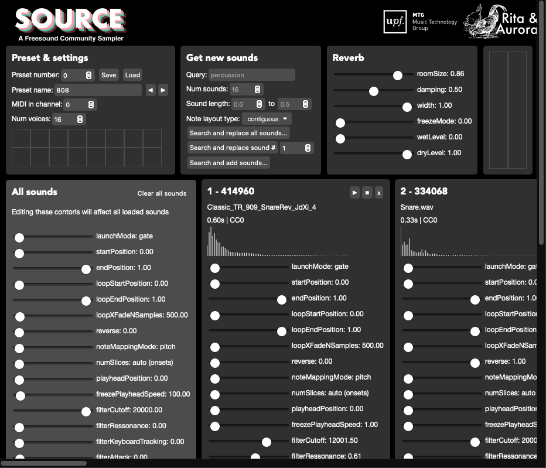
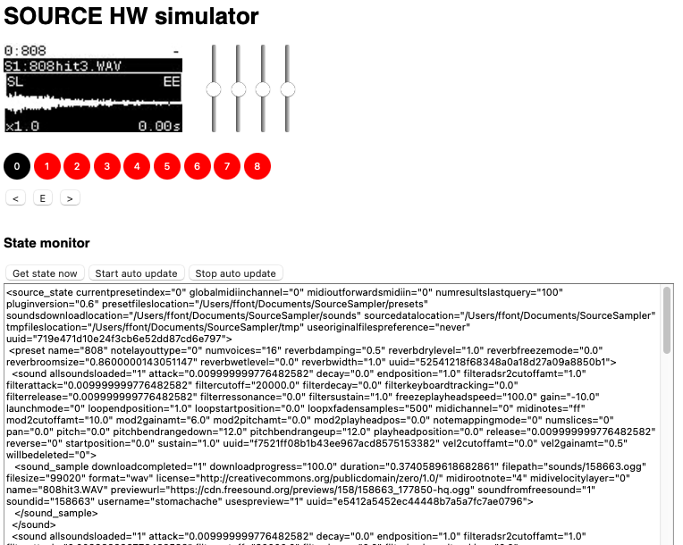

<p align="center">

</p>


Table of Contents
=================

   * [Table of Contents](#table-of-contents)
   * [About](#about)
      * [Why making SOURCE?](#why-making-source)
      * [Features](#features)
      * [How it works](#how-it-works)
      * [How can I run SOURCE](#how-can-i-run-source)
         * [Running SOURCE in the Elk hardware stack](#running-source-in-the-elk-hardware-stack)
         * [Running SOURCE as an audio plugin or standalone app in desktop/laptop computers](#running-source-as-an-audio-plugin-or-standalone-app-in-desktoplaptop-computers)
   * [Instructions for developers](#instructions-for-developers)
      * [Building SOURCE sampler engine](#building-source-sampler-engine)
         * [Build standalone/plugin for desktop (macOS)](#build-standaloneplugin-for-desktop-macos)
         * [Build plugin for Elk platform](#build-plugin-for-elk-platform)
            * [Prepare Elk development SDK](#prepare-elk-development-sdk)
            * [Prepare VST2 SDK](#prepare-vst2-sdk)
            * [Do the cross-compilation](#do-the-cross-compilation)
            * [Deploying SOURCE in the Elk board](#deploying-source-in-the-elk-board)
         * [Note about JUCE version used for SOURCE](#note-about-juce-version-used-for-source)
      * [Using the BLACKBOARD simulator in development](#using-the-blackboard-simulator-in-development)
      * [Working on the desktop plugin UI](#working-on-the-desktop-plugin-ui)
      * [Updating available sound parameters](#updating-available-sound-parameters)
   * [License](#license)


# About

SOURCE is an open-source music sampler powered by [Freesound](https://freesound.org)'s collection of 500k Creative Commons sounds contributed by a community of thousands of people around the world. SOURCE is a sampler that *does not sample*. Instead, it provides different ways to load sounds from Freesound and instantly generate new sound palettes to enrich the creative process and bring an endless SOURCE of inspiration.

SOURCE is designed to run as a stand-alone device on a hardware solution based on a [Raspberry Pi 4](https://www.raspberrypi.org/products/raspberry-pi-4-model-b/), the [Elk Pi](https://elk.audio/extended-dev-kit) hat for the Raspberry Pi (which provides low-latency multi-channel audio I/O), and the [Elk BLACKBOARD](https://elk.audio/blackboard) controller board (which provides the user interface elements including buttons, faders, a display, and the audio I/O connectors). However, the core of SOURCE is implemented as a standard audio plugin using [JUCE](https://juce.com). That allows SOURCE to also be loaded in DAWs that support VST/AU plugins, or even run as a stand-alone and cross-platform application in desktop computers (eventhough with somewhat limited functionality). The picture below shows the looks of SOURCE as deployed with the Elk hardware stack:

<p align="center">

</p>

To see SOURCE in action you can check out this **demo video**: https://youtu.be/7EXMY0AvBxo
Also, I published a paper about source in the **2nd International Workshop on the Internet of Sounds**, part of the **Audio Mostly 2021** conference. I'm happy to say that SOURCE got the the **Best Demo Award** and the **Industry Award** (awared by Elk) in Audio Mostly 2021. Here is the citation information for the paper (and the [PDF](https://repositori.upf.edu/bitstream/handle/10230/48719/font_am21_source.pdf?sequence=1&isAllowed=y)):

```
Font F. "SOURCE: a Freesound community music sampler." In: Audio mostly, A conference on interaction with sound. Proceedings of the 16th International Audio Mostly Conference AM’ 21; 2021 Sep 1-3; Trento, Italy. New York: Association for Computing Machinery; 2021. p. 182-7. DOI: 10.1145/3478384.3478388 
```


## Why making SOURCE? 

As a researcher at the [Music Technology Group](https://www.upf.edu/web/mtg/) of [Universitat Pompeu Fabra](https://www.upf.edu), I have been leading the development of the Freesound website and coordinating research projects around it for a number of years. I've been always interested in how to take advantage of the creative potential of Freesound's huge sound collection, and in ways to better integrate Freesound in the creative process. Even though 
SOURCE started as a personal side project (that's why the [Rita & Aurora](https://ritaandaurora.github.io) logo is shown below, a fancy name I sometimes use for audio dev side-projects), I soon realized about the potential of the prototype and saw that SOURCE can bring together many of the research ideas that we have been experimenting with at the MTG in the last years. I believe that SOURCE can be a great music-making tool for creators, but I also think it can be a great playground for experimentation and research about the interaction between hardware devices and huge sound collections like Freesound.


## Features

SOURCE implements audio playback functionality which is common in many existing music samplers. Perhaps more interesting and unique are the capabilities of SOURCE for interacting with Freesound, searching and retrieving sounds. The SOURCE demonstration video linked above showcases some of these possibilities. Here is a (potentially incomplete) list of features:

* Search sounds in Freesound in real-time and download them to the sampler
* Filter sounds by:
 * Textual query terms
 * Duration
 * Creative Commons license
 * Perceptual qualities like: *brightness*, *hardness* and *depth*
* Replace loaded sounds by other sounds that are acoustically similar (using Freesound's similarity search feature)
* Random search mode that will retrieve unexpected sounds from Freesound
* Load any number of sounds (only limited by RAM memory)
* Map loaded sounds to MIDI notes automatically using *contiguous* or *interleaved* modes, or map them arbitrarily using a mapping editor
* For each sound loaded, configure sound paramters such as:
 * Start and end position
 * Play modes including looping and slicing
 * Loop start and end positions
 * ADSR amplitude envelope
 * Low-pass filter with ADSR envelope
 * MIDI root note and global pitch shift (based on playback speed)
 * Freeze mode in which the playhead position can be controlled as a sound parameter
 * Modulation of some of the above parameters with velocity and aftertouch (including support for polyhonic aftertouch)
 * Control some of the above parameters with MIDI Control Change
* Get a *sound usage log* which lists the historic of sounds that have been used and can help in the Creative Commons attribution process

Note that the most interesting bit of SOURCE is it's methods for interacting with Freesound. The audio engine itself is rather basic and, well, those experience music sampler developers might find it naive. I'm open to contributions if anyone with more experience implementing music samplers wants to help :)

## How it works

SOURCE is composed of a number of software processes that run on a hardware solution based on a [Raspberry Pi 4](https://www.raspberrypi.org/products/raspberry-pi-4-model-b/), the [Elk Pi](https://elk.audio/extended-dev-kit) hat for the Raspberry Pi (which provides low-latency multi-channel audio I/O), and the [Elk BLACKBOARD](https://elk.audio/blackboard) controller board (which provides the user interface elements including buttons, faders, a display, and the audio I/O connectors). All software processes run under [Elk Audio OS](https://elk.audio/audio-os), an operative system optimized for low-latency and real-time audio systems. The core of SOURCE is the *sampler engine* which is implemented as a VST plugin and is run by the *sushi* process (a plugin host bundled with Elk Audio OS). The communication with the sensors of the controller board is carried out by the *sensei* process, which is also part of the Elk Audio OS distribution. Finally, a *glue app* is responsible for connecting all the sub-systems together (mostly via Open Sound Control/Websockets), controlling the state of the user interface, exposing an HTTP endopoint that offers a complementary user interface, and, most importantly, communicating with Freesound to search and download sounds. Below there is a block diagram including all the aforementioned software processes and hardware elements. 

<p align="center">

</p>


## How can I run SOURCE

### Running SOURCE in the Elk hardware stack

This repository includes a deploy script written in Python3 (using the [`fabric`](http://www.fabfile.org) package) which will carry out most of the necessary deployment steps for running SOURCE in the Elk hardware stack. However, a number of things need to be done before running the deploy script. The steps below assume that you have a Rasoberry Pi with an Elk Pi hat and the Elk BLACKBOARD with Elk Audio OS (>=0.7.2) up and running and that you can access it through `ssh` using the default user `mind` created by the Elk Auiod OS installation. If you're looking at running SOURCE as an audio plugin in a desktop computer, see the [instructions below](#running-source-as-an-audio-plugin-or-standalone-app-in-desktoplaptop-computers).


1. Clone the source code repository in your local computer

```
git clone https://github.com/ffont/source.git && cd source && git submodule update --init
```

2. Get a Freesound API key from https://freesound.org/apiv2/apply, and create a file named `freesound_api_key.py` inside the `elk_platform/ui_app` folder of the cloned repository with the contents:

```
FREESOUND_API_KEY = "YOUR FREESOUND API KEY"
FREESOUND_CLIENT_ID = "YOUR FREESOUND CLIENT ID"
```

3. Install Python3 depencies of the deploy script in your local computer

```
pip install -r requirements_fabfile.txt
```

4. Download the *pre-compiled binaries* of the latest release of SOURCE sampler engine for the Elk platform (or [build them locally following the instructions in sections below](#build-plugin-for-elk-platform)). Copy `SourceSampler.so` to `SourceSampler/Builds/ElkAudioOS/build/SourceSampler.so` (you might need to create intermediate folders). Note that this path is relative to the root of the cloned repository. 

5. Configure key-based ssh access to the Elk board form the local machine. If you already have ssh keys created in your local computer, you can install them in the Elk board running something like `ssh-copy-id - i ~/.ssh/id_rsa.pub mind@your-elk-board-hostname`.

6. Give extra sudo permissions to `mind` user in the Elk board. Follow these steps:

   * ssh into the Elk board and run `sudo su` to switch to `root` user 
   * rdit `/etc/sudoers` to add the line `mind ALL=(ALL) NOPASSWD: ALL` in the *User privilege specification* AND comment the line `# %sudo ALL=(ALL) ALL`.

7. Edit the file named `fabfile.py` and set the `host` varialbe in line 7 to match the host of your Elk board.

After the above steps, you can run the SOURCE deploy script using the command below. This will copy all the necessary app files to the board, configure the `systemd` services `sushi` (the audio plugin), `source` (the glue app/UI app) and `sensei` (the inerface with physical sensors), and start them. This will also configure the services to auto start on boot.

8. Run `fab deploy-elk`

And that's it! While the above mentioned services are running in the Elk board, you can use these utility commands bundled in the deploy script to see their logs:

```
fab logs-sushi
fab logs-source
fab logs-sensi
```

Note that to get **MIDI input** working you'll need to use a USB MIDI controller or interface, and might need to [edit this line of code](https://github.com/ffont/source/blob/b0b82a9712341e3280e45053239df48b8dbe8a5f/elk_platform/ui_app/main#L285) and set the id of the USB MIDI controller/interface (you can get a list of MIDI devices ids in the Elk board running `aconnect -l`).


### Running SOURCE as an audio plugin or standalone app in desktop/laptop computers

SOURCE can also be run as a desktop audio plugin. This version of SOURCE lacks some functionality with respect to the hardware version, but it is perfectly usable and has its own graphical UI.

<p align="center">

</p>

**macOS**

To use SOURCE as an audio plugin in macOS you can simply download the pre-compiled binary files from the [releases](https://github.com/ffont/source/releases) section and copy them to the appropriate audio plugin system locations (that is to download the latest release fiels and copy `SourceSampler.component` to `/Library/Audio/Plug-Ins/Components` and/or copy `SourceSampler.vst3` to /`Library/Audio/Plug-Ins/VST3`).

On macOS, SOURCE can also be run as a standalone application by opening the `SourceSampler.app` bundle included in the release files.

**linux and windows**

We don't include pre-compiled binaries for linux and windows operative systems in the releases so SOURCE must be compiled from source in order to run on linux or windows. However, because the engine of SOURCE is implemented as a JUCE audio plug-in, it should not be complicated to add exporters for linux and windows to the Projucer file and compile. In the future I might consider including pre-built binaries for linux and windows as well.


# Instructions for developers

## Building SOURCE sampler engine

The sampler engine of source SOURCE is implemented as a JUCE audio plug-in and can be edited and built using standard JUCE workflows. The first step is to clone this repository and init the submodules. Then, different steps apply to build SOURCE for desktop computers or for the Elk platform (see below).

```
git clone https://github.com/ffont/source.git && cd source && git submodule update --init
```

### Build standalone/plugin for desktop (macOS)

For development purposes (or to run SOURCE in a desktop computer insead of the Elk platform), you can use the XCode project files generated by Projucer. You can also generate exporters for other platforms using Projucer, but I only tested macOS.

Alternatively, you can also use the Python3 deploy script bundled in this repo to run the compilation step (note that you need to install dependencies for the deploy script by running `pip install -r requirements_fabfile.txt`):

```
fab compile-macos
```

This will create *Release* versions of SOURCE (VST3, VST2, AU and Standalone) ready to work on the mac. If you need *Debug* build, you can run `fab compile-macos-debug`.

**NOTE**: macOS build targets include a *pre-build shell script* phase which generates the `BinaryData.h/.cpp` files needed for the plugin to include up-to-date resources (mainly `index.html`). These files are generated with the `BinaryBuilder` util provided in the JUCE codebase. `BinaryBuilder` is compiled as part of the build process so you should encounter no issues with that.

**NOTE 2**: macOS build targets require `openssl` to implement the HTTPS sevrer that hosts the plugin UI. Install by using `brew install openssl`.

**NOTE 3**: SOURCE requires a Freesound API key to connect to Freesound. You should make an account in Freesound (if you don't have one) and go to [this URL to generate an APi key](https://freesound.org/apiv2/apply). Then you should edit the file `/source/SourceSampler/Source/api_key.example.h`, add your key, and then then save and rename the file to `/source/SourceSampler/Source/api_key.h`.

**NOTE 4**: For development you might need to edit the `SourceSampler.jucer` Projucer file. To do that, you need a compatible version of Projucer installed. You can compile it (for macOS) from JUCE source files using a the deploy script running: `fab compile-projucer-macos`. The generated executable will be in `/source/SourceSampler/3rdParty/JUCE/extras/Projucer/Builds/MacOSX/build/Release/Projucer.app`.

**NOTE 5**: SOURCE is configured to build a VST2 version of the plugin (together with VST3, AudioUnit and StandAlone). VST2 is currently only needed for the Elk build as there still seem to be some issues with JUCE6 + VST3 in linux. However, VST is not really needed for the macOS compilation. If you don't have the VST2 SDK available, just open `SourceSampler.jucer` (you'll need to compile Projucer first as described in the previous step) and untick `VST Legacy` option.


### Build plugin for Elk platform

To build SOURCE for Elk Audio OS you need to cross-compile it from your development computer. To do that, I use a Docker-based solution on macOS. The instructions here are therefore for cross-compiling from macOS and using Docker. For cross-compilation from Linux it should be simpler and you should refer to the Elk docs. The python deploy script bundled in this repository will automate most of the steps for compiling SOURCE for the Elk platform. To run that script you'll need to install the required Python3 dependencies by running `pip install -r requirements_fabfile.txt`. The sections below guide you through the process of preparing your dev environment for compiling SOURCE for the Elk platform and show how to do th actual compilation.


#### Prepare Elk development SDK

The first thing to do is to prepare the Elk development SDK Docker image following the [instrucitons here](https://github.com/elk-audio/elkpi-sdk/blob/master/running_docker_container_on_macos.md). You need to run steps 1 to 3, no need to run the toolchain when everything installed.

#### Prepare VST2 SDK

Even though JUCE 6 has support for VST3 plugins in Linux, I've had some issues with VST3 versions of plugins in Linux and therefore SOURCE is still being built as VST2. This means that you need the VST2 SDK installed in your computer to compile SOURCE. Make sure that the `PATH_TO_VST2_SDK` variable in `fabfile.py` points to a valid distribution of the VST2 SDK. This will be mounted in the Docker container that does the cross-compilation. Of course you also need to get the VST2 SDK files from somewhere.

#### Do the cross-compilation

With all this in place, you should be able to cross-compile SOURCE for Elk in a very similar way as you would do it for the desktop version, using the deploy script:

```
fab compile-elk
```

(if you need a *Debug* build, you can use `fab compile-elk-debug`)

This will take a while, specially the first time it runs. When it finishes, it should have generated a `SourceSampler.so` file in `source/Builds/ElkAudioOS/build/` which is the VST2 plugin that you can run in the Elk platform. It also generates a VST3 in `source/Builds/ElkAudioOS/build/SourceSampler.vst3` which should also compatible with the Elk platform but there still seem to be issues with the VST3 version so it is not really used.

**NOTE**: The build script for the cross compilation includes a step which generates the `BinaryData.h/.cpp` files needed for the plugin to include up-to-date resources (mainly `index.html`). This is run in the host machine and not in the Docker container. For this step to succeed, you need to compile the  `BinaryBuilder` util provided by JUCE. You can compile that by running `fab compile-binary-builder-macos`.


#### Deploying SOURCE in the Elk board

Once the plugin is compiled for the Elk architecture, you can install it in the Elk board by following the steps for [Running SOURCE in the Elk hardware stack](#running-source-in-the-elk-hardware-stack).


### Note about JUCE version used for SOURCE

The current version of SOURCE uses JUCE 6 which has native support for VST3 plugins in Linux and for headless plugins. Therefore, unlike previous version of SOURCE, we don't need any patched version of JUCE and we can simply use the official release :) However, there still seem to be problems with VST3 and Linux related with timers, so we use VST2 builds.

 
## Using the BLACKBOARD simulator in development

In order to facilitate development of the *hardware* version of SOURCE when the Elk tech stack is not available, the *glue app* implemented in Python3 can also be run from your local computer and includes a web simulator of the BLACKBOARD hardware that can be used as user interface. The glue app will communicate with the plugin, which must be running also in your local computer as a standalone app and must have been compiled in Debug mode, and you can point your browser at `http://localhost:8123/simulator` to see the BLACKBOARD simulator that looks like this:

<p align="center">

</p>

These are the steps to get the simulator up and running:

1. Compile the desktop version of the plugin in Debug mode and run it as a Standalone app (or as a plugin inside a DAW)
2. Install python dependencies for the glue app, and run the glue app

```
cd elk_platform/ui_app
pip install -r requirements.txt
pyhon main
```
3. Point your browser to `http://localhost:8123/simulator` and use the buttons on screen to interact with the plugin as if interactions came from the hardware BLACKBOARD.


## Working on the desktop plugin UI

The desktop version of the plugin has its own UI which is implemented using HTML/Javascript and is loaded in the plugin using JUCE's *WebComponent*. Here is the code for the desktop plugin UI https://github.com/ffont/source/blob/master/SourceSampler/Resources/ui_plugin_ws.html. The plugin embeds a WebSockets server to implement bi-directional communication with the plugin HTML/Javascript UI. The plugin also embeds an HTML server which is used for serving sound files to the UI so that waveforms can bw shown.

The `ui_plugin_ws.html` file conataining the desktop UI is embedded in the plugin binary at compile time, therefore if changed need to be done to the UI the whole plugin needs to be re-comiled for these changes to take effect in the plugin (or standalone app). However, if while the plugin is running (in Debug mode), the `ui_plugin_ws.html` is opened with a standard web browser, then the interface is rendered in the browser and it can also connect to the running plugin instance. Now, the borwser console can be used to instpect the state of the UI, and the HTML file can be edited with your editor of choice and the browser page reloaded in the browser for any changes to take effect (without the need of recompiling the whole plugin). This tick is very conveinent when working on the UI :)

Also note that this desktop UI can also be used when the plugin is running in the Elk board by simply configuring the WebSockets host and port to that of the plugin instance running in the Elk board.


## Updating available sound parameters

The SOURCE sampler engine has a many editable sound parameters including things like *start position*, *end position*, *pitch*, *filter cutoff*, etc. Because there are many of these parameters and there is a lot of "repeated" code for setting up the parameters and doing some stuff witht them, this repository includes a python script that auto-generates most of the code needed for deadling with such parameters (for implementing getters, setters, etc). The script can be found here https://github.com/ffont/source/blob/master/SourceSampler/generate_code.py and has no special python dependencies.

To edit existing sound parameters or add/remove new ones, you can do that by editing the [data_for_code_gen.csv](https://github.com/ffont/source/blob/master/SourceSampler/data_for_code_gen.csv) CSV file (in which you have information about the parameter names, min/max/default values and other potentialy relevant things), and then run:

```
cd SourceSampler
python geneate_code.py -i
```

After that the parameters will be available in your `SourceSound` objects, and will also be automatically added to the desktop UI of the plugin.

        
# License

SOURCE is released under the **GPLv3** open source software license (see [LICENSE](https://github.com/ffont/source/blob/master/LICENSE) file) with the code being available at  [https://github.com/ffont/source](https://github.com/ffont/source). Source uses the following open source software libraries: 

* [juce](https://juce.com), available under GPLv3 license ([@2f98020](https://github.com/juce-framework/JUCE/commit/2f980209cc4091a4490bb1bafc5d530f16834e58), v6.1.6)
* [cpp-httplib](https://github.com/yhirose/cpp-httplib), available under MIT license ([@3da4a0a](https://github.com/yhirose/cpp-httplib/tree/3da4a0a))
* [ff_meters](https://github.com/ffAudio/ff_meters), available under BSD 3 clause license ([@711ee87](https://github.com/ffont/ff_meters/tree/711ee87862e1c2485536e977ab57b1f78b84667f), I use a fork I made with a small patch for compatibility with Elk)
* [twine](https://github.com/elk-audio/twine), available under GPLv3 license ([@1257d93](https://github.com/elk-audio/twine/tree/1257d93882cf9fd120539a2ce5497fcbef22af82))
* [asio](https://github.com/chriskohlhoff/asio), available under Boost Sofrware License] ([@f0a1e1c](https://github.com/chriskohlhoff/asio/tree/f0a1e1c7c0387ad16358c81eb52528f190df625c))
* [Simple-WebSocket-Server](https://gitlab.com/eidheim/Simple-WebSocket-Server), available under MIT license ([@a091e7c](https://gitlab.com/eidheim/Simple-WebSocket-Server/-/tree/a091e7cfb1587e3c0340bc7d2d850a4e44c03e11))

<br><br>
<p align="center">

&nbsp;&nbsp;&nbsp;&nbsp;&nbsp;&nbsp;&nbsp;&nbsp;&nbsp;

</p>
